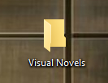
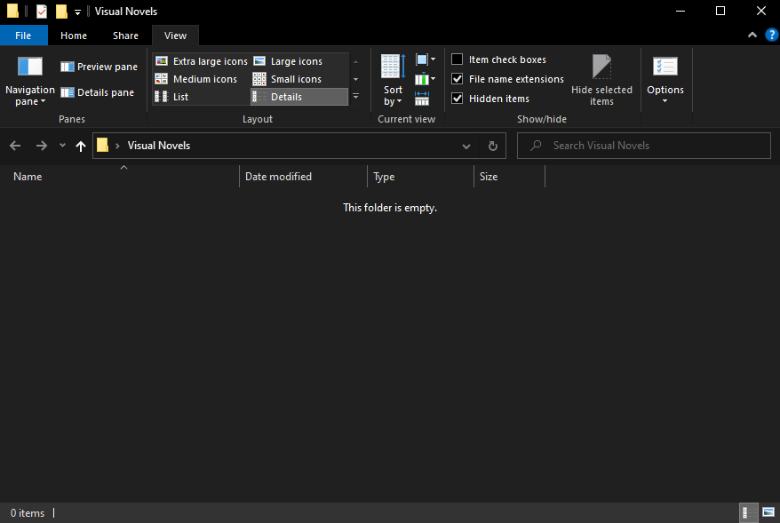
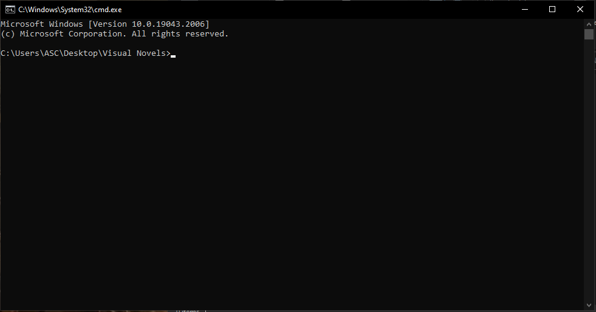
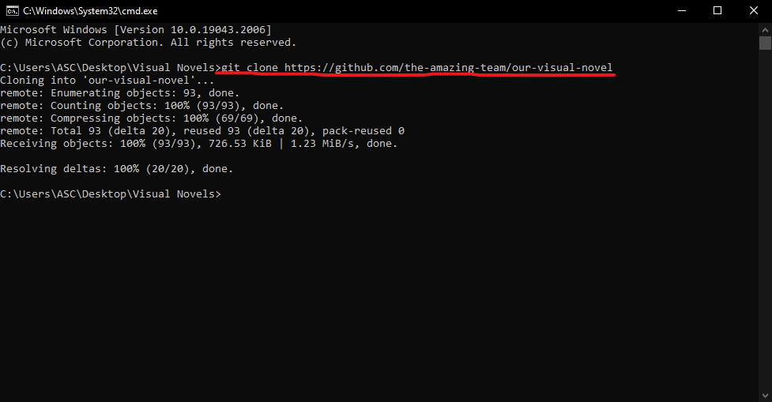
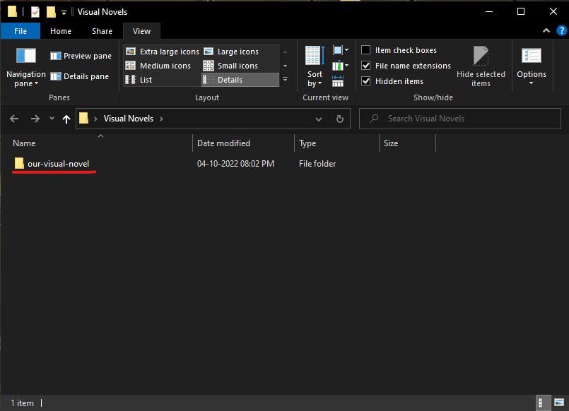
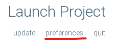
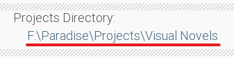
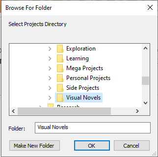
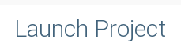

# Our Visual Novel

## How to setup

- Make a local instance of the repository

  - Create a folder where you would store all your Visual Novel Projects
  

   
  

  - Open the **Projects Folder**
  

   
  

  - Open a **terminal** in that folder
  

   
  

  - `git clone` the repository in your **Projects Folder**
  

   
  

  - You will see the repository cloned
  

   
  

- Open **Renpy** and go to **Preferences**
  

   
  

- Configure your project directory for **Renpy**
  

   
  

  

   
  

- Go back to the menu and **open the project**
  

   
  

- Lanuch the project
  

   
  

